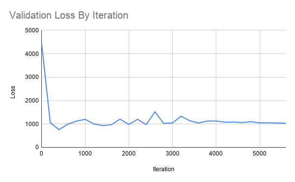
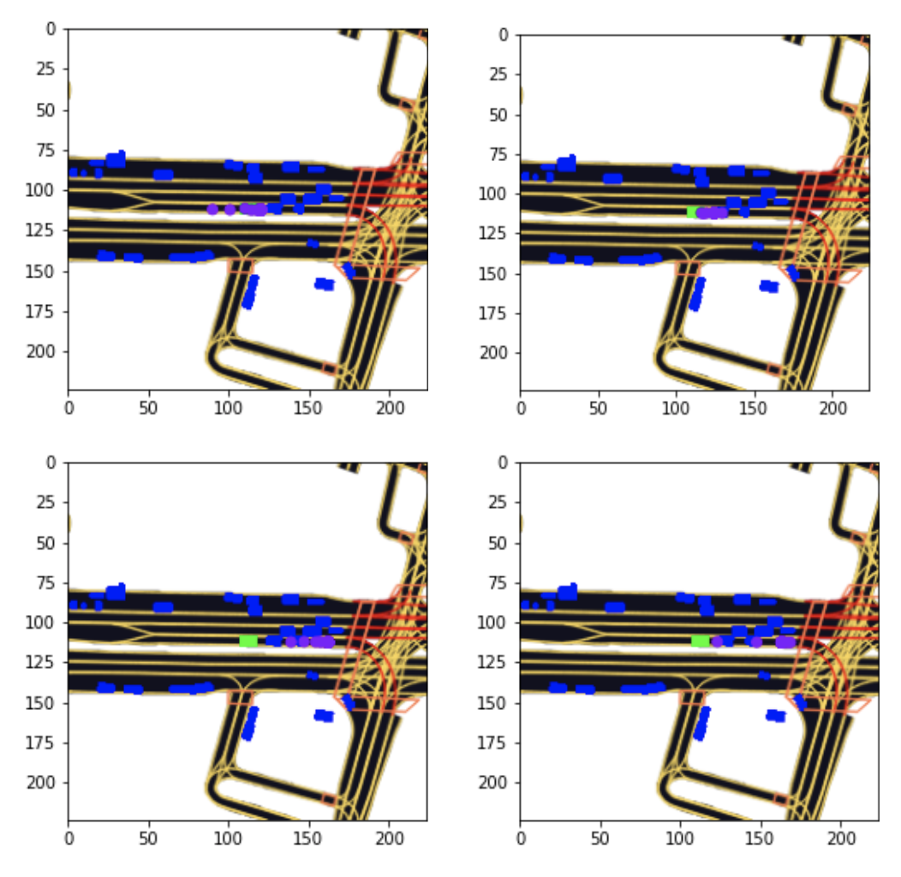

# CS7643Project
Lyft Motion Prediction Challenge

This project implements the motion prediction algorithm described in the paper linked [here](https://arxiv.org/abs/2005.02545) and applies it in the [Lyft Motion Prediction for Autonomous Vehicles](https://www.kaggle.com/c/lyft-motion-prediction-autonomous-vehicles) challenge using the Lyft dataset and using l5kit. The model training and analysis is contained in the NewRnnCnn.ipynb and the model itself is defined in mhajam.py. The dataset definition occurs in MultiAgentLoaders.py. The trained model checkpoints are saved in Exported Models.

## Run Instructions:
Run NewRnnCnn.ipynb to train and view results. We used Google Colab and mount the project folder in the notebook. To reproduce this, mount this repository in your drive and change the projectPath variable to the path to point to this directory. 

## Results:
The final loss we had was 314, though we know of some bugs that may be limiting this. The loss curve is pictured:

For visualizations, view the items in trajectoryPlots. Some sample generated trajectories are shown in the plot below. The green car is the target vehicle, the blue is surrounding agents, and the purple is future trajectories. Each of these images is a possible trajectory predicted by a different head for the same situation.

